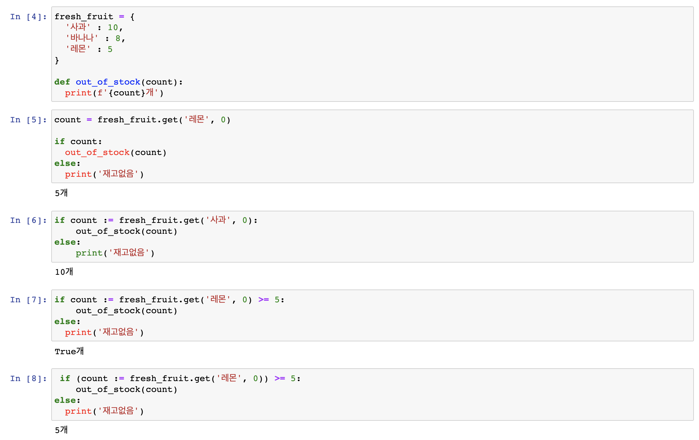

# 1. 파이썬 답게 생각하기 (better way 6 ~ 10)

## Better way 6 .  인덱스를 사용하는 대신 대입을 사용해 데이터를 언패킹하라


```python
snacks = [('베이컨', 350), ('도넛',240), ('머핀',190)]

// 예제1.
for i in range(len(snacks)) :
    item = snacks[i]
    name = item[0]
    calories = item[1]
    printf(f'#{i+1}: {name} 은 {calroies} 칼로리입니다.')
  
  
//예제 2.
for rank, (name, calories) in enumerate(snacks, 1):
    printf(f'#{rank}: {name} 은 {calroies} 칼로리입니다.')
  
```

> **기억해야 할 내용**
>
> * 파이썬은 한 문장 안에서 여러 값을 대입할 수 있는 언패킹이라는 특별한 문법을 제공한다.
> * 파이썬 언패킹은 일반화돼 있으므로 모든 이터러블에 적용할 수 있다. 그리고 이터러블이 여러 계층으로 내포된 경우에도 언패킹을 적용할 수 있다.
> * 인덱스를 사용해 시퀀스 내부에 접근하는 대신 언패킹을 사용해 시각적인 잡음을 줄이고 코드를 더 명확하게 만들라.


## Better way 7.  range 보다는 enumerate 를 사용하라.

```python

flavor_list = ['바닐라', '초콜릿', '피칸', '딸기']

for i in range(len(flavor_list))
	flavor = flavor_list[i]
  print(f'{i + 1} : {flavor}'')
>>>
1: 바닐라
2: 초콜릿
3: 피칸
4: 딸기

it = enumerate(flavor_list)
print(next(it))
print(next(it))

>>>
(0, '바닐라')
(1, '초콜릿')

```

>**기억해야 할 내용**
>
>* enumerate 를 사용하면 이터레이터에 대해 루프를 돌면서 이터레이터에서 가져오는 원소의 인덱스까지 얻는 코드를 간결하게 작성할 수 있다.
>* range에 대해 루프를 돌면서 시퀀스의 원소를 인덱스로 가져오기보다는 enumerate를 사용하라.
>* Enumerate 의 두 번째 파라미터로 어디부터 원소를 가져오기 시작할지 지정할 수 있다.(default value : 0)


## Better way 8.  여러 이터레이터에 대해 나란히 루프를 수행하려면 zip 을 사용하라.

```python
names = ['Cecilia', '남궁민수', '손정의']
counts = [len(n) for n in names]
print (counts)

>>>
[7, 4, 3]


for name, count in zip(names, counts):
  if( count > max_count) :
    	longest_name = name;
      max_count = count;      
```


> **기억해야 할 내용**
>
> * zip 내장 함수를 사용해 여러 이터레이터를 나란히 이터레이션 할수 있다.
> * zip 은 튜플을 지연 계산하는 제너레이터를 만든다. 따라서 무한히 긴 입력에도 zip 을 쓸 수 있다.
> * 입력 이터레이터의 길이가 서로 다르면 zip은 아무런 경고도 없이 가장 짧은 이터레이터 길이까지만 튜플을 내놓고 더 긴 이터레이터의 나머지 원소는 무시한다.
> * 가장 짧은 이터레이터에 맞춰 길이를 제한하지 않고 길이가 서로 다른 이터레이터에 대해 루프를 수행하려면 itertools 내장 모듈의 zip_longest 함수를 사용하라.

## Better way 9.  for 나 while 루프 뒤에 else 블록을 사용하지 말라


bad grammar

```python
//break 가 걸리지 않으면 else 구분은 실행된다.
for i in range(3) :
  print('Loop' , i)
else:
  print('Else block!')
 
>>> 
Loop 0
Loop 1
Loop 2
Else block!


// for 문이 실행되고 if break 가 걸리면 else 문은 실행되지 않는다.
for i in range(3):
  print('Loop', i)
  if i == 1:
    break;
 else:
  print('Else block!')
  
>>>
Loop 0
Loop 1

// 한번도 실행되지 않은 for 문 뒤의 else 는 실행된다.
for x in []
	print('이줄은 실행되지 않음')
else : 
  print('For Else Block!')
  
>>>
For Else Bolck!


```

>**기억해야 할 내용**
>
>* 파이썬은 for 나 while 루프에 속한 블록 바로 뒤에 else 블록을 허용하는 특별한 문법을 제공한다.
>* 루프 뒤에 오는 else 블록은 루프가 반복되는 도중에 break 를 만나지 않은 경우에만 실행된다.
>* 동작이 직관적이지 않고 혼동을 야기할 수 있으므로 루프 뒤에 else 블록을 사용하지 말라.


## Better way 10. 대입식을 사용해 반복을 피하라.


* 대입식(assignment expression) - 왈러스 연산자(walrus operator)
* a := b 
  * a 왈러스 b 라고 읽음
  * 대입식의 값은 왈러스 연산자 왼쪽에 있는 식별자에 대입된 값
  * 대입문이 쓰일 수 없는 위치에서 변수에 값을 대입할 수 있어서 유용

```python
fresh_fruid = {
  '사과' : 10, 
  '바나나', : 8, 
  '레몬' : 5
}

def out_of_stock(count):
  print(f'{count}개')
 

###
count = fresh_fruit.get('레몬', 0)

if count:
  out_of_stock(count)
else:
  print('재고없음')

>> 5개
  
### 한 번만 쓰이는 변수
if count := fresh_fruit.get('사과', 0):
    out_of_stock(count)
else:
    print('재고없음')

>>> 10개    
    
 ### 대입식 결과와 비교연산자가 있을 경우 대입식을 괄호로 감싼다.

if count := fresh_fruit.get('레몬', 0) >= 5:
    out_of_stock(count)
else:
  print('재고없음')
>>> True개  
  
 if (count := fresh_fruit.get('레몬', 0)) >= 5:
    out_of_stock(count)
else:
  print('재고없음')
>>> 5개
  
```




> **기억해야 할 내용**
>
> * 대입식에서는 왈러스 연산자(:=) 를 사용해 하나의 식 안에서 변수 이름에 값을 대입하면서 이 값을 평가할 수 있고, 중복을 줄일수 있다.
> * 대입식이 더 큰 식의 일부분으로 쓰일 때는 괄호로 둘러싸야 한다.
> * 파이썬에서는 switch/case 문이나 do/while 루프를 쓸 수 없지만, 대입식을 사용하면 이런 기능을 더 깔끔하게 흉내낼 수 있다.