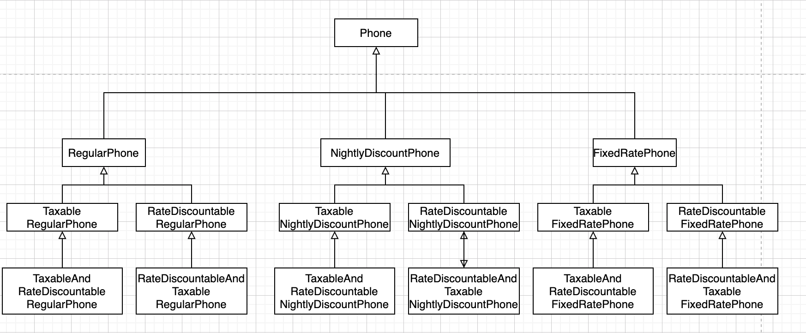
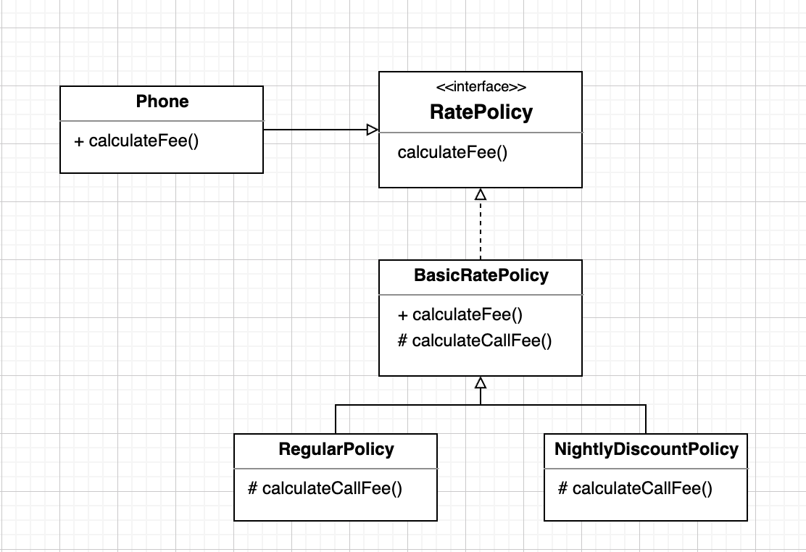

# chapter 11. 합성과 유연한 설계

* 상속관계 : is - a 관계
* 합성관계 : has -a 관계


상속 : 구현은 간단하나 자식과 부모 클래스 사이의 결합도가 높아짐.

* 클래스 사이의 정적인 관계

합성: 객체의 구현이 아닌 퍼블릭 인터페이스에 의존. 포함된 객체의 내부 구현이 변경되더라도 영향을 최소화 할 수 있다. 

* 객체 사이의 동적인 관계
* 변경하기 쉽고 유연한 설계를 얻을 수 있다. 

`코드 재사용을 위해서는 ` 객체 합성이 클래스 상속보다 더 좋은 방법이다. 


## 01. 상속을 합성으로 변경하기


**기존 10장 에서 보았던 코드에서 상속관계 제거 후 합성관계로 변경** 

```java
public class Properties {
  private HashsTable<String, String> properties = new HashTable<> ();
  
  public String getProperty(String key, String value){
    return properties.get(key, value);
  }
  
  public void setProperty(String key, String value){
    properties.put(key, value);
  }
}
```


> 몽키 패치란 현재 실행중인 환경에만 영향을 미치도록 지역적으로 코드를 수정하거나 확장하는 것을 가리킨다. 
>
> 자바는 언어 차원에서 몽키 패치를 지원하지 않기 때문에 바이트 코드를 직접 변환하거나 AOP를 이용해 몽키 패치를 구현하고 있다.


## 02. 상속으로 인한 조합의 폭발적인 증가


**추상 메서드와 훅 메서드**

> 개방-폐쇄 원칙을 만족하는 설계를 만들 수 있는 한 가지 방법은 부모 클래스에 새로운 추상 메서드를 추가하고 부모 클래스의 다른 메서드 안에서 호출하는 것이다. 자식 클래스는 추상 메서드를 오버라이딩하고 자신만의 로직을 구현해서 부모 클래스에서 정의한 플로우에 개입할 수 있게 된다. 처음에 phone 클래스에서 두 메서드를 오버라이딩한 것 역시 이 방식을 응용한 것이다. 
>
> 추상메서드의 단점은 상속 계층에 속하는 모든 자식 클래스가 추상 메서드를 오버라이딩해야 한다는 것이다. 대부분의 자식 클래스가 추상 메서드를 동일한 방식으로 구현한다면 상속 계층 전반에 걸쳐 중복 코드가 존재하게 될 것이다. 해결 방법은 메서드에 기본 구현을 제공하는 것이다. 이처럼 추상 메서드와 동일하게 자식 클래스에서 오버라이딩 할 의도로 메서드를 추가했지만 편의를 위해 기본 구현을 제공하는 메서드를 훅 메서드 라고 부른다. 





**클래스 폭발 문제 또는 조합의 폭발 문제**

> 상속의 남용으로 하나의 기능을 추가하기 위해 필요 이상으로 많은 수의 클래스를 추가해야하는 경우


## 03. 합성 관계로 변경하기

상속 관계 : 컴파일타임에 결정되고 고정됨

* 여러 기능을 조합해야하는 설계에 상속을 이용하면 위의 경우 처럼 케이스별로 클래스를 추가해야한다.

합성 관계: 구현이 아닌 퍼블릭 인터페이스에 대해서만 의존하기에 런타임에 객체 관계를 변경할 수 있다.


```java
public class Phone {
  private RatePolicy ratePolicy;
  private List<Call> calls = new ArrayList<>();
  
  public Phone(RatePolicy ratePolicy) {
    this.ratePolicy = ratePolicy;
  }
  
  public List<Call> getCalls() {
    return Collections.unmodifiableList(calls);
  }
  
  public Money calculateFee(){
    return ratePolicy.caculateFee(this);
  }
}
```

Phone 내부 RatePolicy 에 대한 참조자가 있다. 

이것이 합성이다. 


**합성 관계를 사용한 기분 정책의 전체적인 구조**




**기본 정책과 부가 정책 합성하기**

```java
// 일반 요금제에 세금 정책을 조합할 경우
Phone phone = new Phone(
										new TaxablePolicy(0.05), 
  											new RegualarPolicy(...));

// 일반 요금제에 기본 요금 할인 정책을 조합한 결과에 세금 정책을 조합할 경우
Phone phone = new Phone(
										new TaxablePolicy(0.05), 
  											new RateDiscountablePolicy(Money.wons(1000), 
  											new RegualarPolicy(...));

```


**객체 합성이 클래스 상속보다 더 좋은 방법이다.**

코드를 재사용 하면서 건전한 결합도를 유지할 수 있는 더 좋은 방법은 합성이다. 

상속은 나쁜것인가? 사용해서는 안되는것인가? 

상속의 종류

* 구현상속
* 인터페이스 상속

이번장에서 살펴본 상속에 대한 모든 단점은 **구현상속**에 국한한다.

**인터페이스 상속** 은  **13장** 에서 살펴볼 예정이다.


## 04. 믹스인

믹스인(mixin) 객체를 생성할 때 코드 일부를 클래스 안에 섞어 재사용하는 기법

* 코드 재사용에 특화된 방법이면서도 상속과 같은 결합도 문제를 초래하지는 않는다.
* 코드를 다른 코드 안에 유연하게 섞어 넣을 수 있다면 믹스인이라고 부를수 있다.

